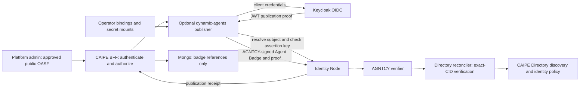
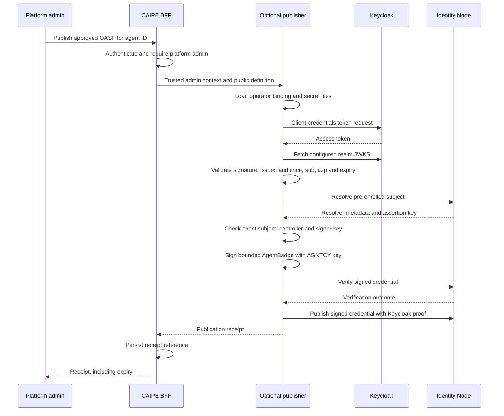

# Optional Keycloak-authenticated Agent Badge publication for CAIPE dynamic agents

## Decision proposed

Use Keycloak's existing OAuth client-credentials flow to authenticate a platform-managed agent for AGNTCY badge publication. An AGNTCY issuer signs the Agent Badge; Identity Node stores and serves the signed credential. Make publication an explicit, disabled-by-default CAIPE integration.

Keycloak access tokens authorize publication. Agent Badges attest the public agent definition. Directory IdentityClaims prove control of the record's declared identity and bind verification to an exact record CID.

## Architecture

Solid publication flow is the initial implementation. Directory publication, native claim signing, discovery and runtime identity enforcement are separate integrations tracked by the linked proposals and PR.

## Initial implementation contract

- Disabled by default: `AGNTCY_IDENTITY_ENABLED=false`.
- Explicit platform-admin endpoint: `POST /api/dynamic-agents/agents/{id}/badge`.
- Body is an admin-approved public OASF definition. Runtime prompts, tool credentials and private agent configuration are not automatically exported.
- An operator-owned binding maps the Mongo agent ID to a Keycloak client, expected token subject and Node Agent ID. Client secrets and the AGNTCY signing key are mounted files, outside user-editable agent records.
- Validate Keycloak signature, algorithm, issuer, audience, expiry, `sub` and `azp` using the configured JWKS endpoint.
- Resolve the exact Node Agent ID and require the expected controller and an authorized matching assertion key before signing.
- Sign a JOSE AgentBadge containing the exact supplied definition, identity, issuer and a lifetime of at most 15 minutes.
- Ask Node to verify the exact credential, then publish it with the Keycloak token in `proof.proofValue`.
- Return a receipt containing credential ID, subject URI, issuer, expiry, well-known badge URL and a SHA-256 definition digest. The digest is a receipt correlation value, **not a Directory CID**.
- BFF persists the receipt, without bearer tokens, signed credential bodies, private keys or the public definition.

## Compatibility with the current Node

The existing Node already supports generic external OIDC issuers. Live validation found that its resolver response omitted the stored controller; [Identity PR #181](https://github.com/agntcy/identity/pull/181) restores that existing field. The publisher requires this correction and rejects a missing controller. Keycloak follows that path; no new native Node issuance endpoint is necessary for this integration.

- Enroll the issuer and agent metadata using existing issuer registration and ID generation APIs before enabling publication.
- Current generic OIDC IDs are `IDP-<token-sub>`. Directory subjects can therefore be `agntcy://IDP-<token-sub>`; the URI scheme identifies the resolver, independent of the Node's identifier prefix.
- Current resolver metadata copies the registered AGNTCY issuer public key into its assertion method. The publisher must use that matching key. This is platform-managed key control; it does not introduce an independent per-agent signing key or prove that Keycloak signed the badge.
- Keycloak's realm signing keys verify authentication tokens. The registered AGNTCY key verifies Agent Badges. Keep their roles explicit.
- Node's current common-name mapping normally uses the issuer hostname. Do not assume multiple realms sharing one hostname create distinct registered authorities; operator enrollment must account for this limitation.
- The publisher emits Node-compatible credential fields (`context`, `issuanceDate`, `expirationDate`) and a JOSE envelope. It also includes the W3C `@context` field.

Source baseline: [OIDC parser](https://github.com/agntcy/identity/blob/8f7c1b52b5c4585cbd6308053ff43e076d96927e/pkg/oidc/parser.go), [ID generation](https://github.com/agntcy/identity/blob/8f7c1b52b5c4585cbd6308053ff43e076d96927e/internal/node/id_generator.go), [resolver key creation](https://github.com/agntcy/identity/blob/8f7c1b52b5c4585cbd6308053ff43e076d96927e/internal/node/id_service.go), [VC verification and publication](https://github.com/agntcy/identity/blob/8f7c1b52b5c4585cbd6308053ff43e076d96927e/internal/node/vc_service.go).

## Storage and Directory verified search

| System | Stored data / responsibility |
|---|---|
| Keycloak | OIDC clients, service accounts and authentication policy |
| Identity Node | Resolver metadata and actual signed Agent Badges |
| CAIPE Mongo | Existing runtime configurations plus separate publication receipts |
| Directory | OASF record and native IdentityClaims; each claim is JSON type `agntcy.dir.identity.v1.IdentityClaim`, stored as an OCI referrer whose manifest subject references the record manifest |
| Directory reconciler | Resolver signature verification, record-specific badge evidence and bounded verification status |

A record declares one identity using `annotations["agntcy.dir/identity"]`; it can have multiple claims. Publish the **same OASF object** to Directory and in the badge. The verifier derives Directory's CID from the embedded definition and compares it with the signed claim's CID. Do not use the receipt's SHA-256 value for this comparison.

Search combines the native identity-subject predicate, such as `agntcy://*`, with `IDENTITY_VERIFIED=true`. Directory reads reconciled status with a validity deadline. A published badge or Node `status=true` does not by itself make a record Directory-verified.

CAIPE discovery should import external services disabled, retain Mongo as runtime authority, and optionally require authoritative identity verification for the exact CID before activation and use. Cached tools/runtimes must not bypass expiry or changed identity status. The existing status API needs an explicit validity deadline before CAIPE can safely retain a verification lease.

## Lifecycle and failure behavior

- No background publication, startup dependency or identity network access when disabled.
- HTTPS required; explicit HTTP opt-in is only for isolated local integration checks.
- No automatic issuer registration, key replacement or agent metadata migration.
- Invalid token, mismatched key/controller/subject or Node verification failure prevents publication.
- Receipts are publication history, not authorization grants or renewable verification leases.
- Expiry bounds the credential; Node `status=true` alone is insufficient to enforce expiry. Directory/verifier consumers must check validity themselves.
- No automatic renewal or immediate revocation guarantee in this first integration. A Keycloak token or client revocation prevents subsequent publication; it does not retroactively revoke an issued badge.
- Multiple badges can coexist. Repeated requests issue new short-lived credentials. A timeout may leave an unknown publication outcome; credential lookup and receipts support recovery. Idempotent issuance, renewal and supported revocation/status handling require a subsequent lifecycle contract.
- Local PEM signing implements the initial adapter. A protected KMS/HSM/Vault signer should replace it for deployments that cannot mount issuer keys in the runtime.

## Alternative: Keycloak directly issues AgentBadge credentials

Keycloak supports OpenID4VCI, promoted to **preview in 26.8.0**. It can become a credential issuer, but AGNTCY schema mapping, credential envelope compatibility, automated issuance flow and issuer-aware verification must be validated first. A generic JWT or SD-JWT credential is not automatically a compatible AgentBadge.

Direct Keycloak credential signing requires a distinct issuer policy, configured Keycloak trust and credential-status rules. Separate issuer keys from agent proof-of-control keys, and coordinate the accepted policy with Directory. This remains an alternative, not a capability implemented by the initial publisher.

[Keycloak credential issuance guide](https://www.keycloak.org/2026/01/issue-credentials-over-openid4vci), [26.8 release](https://www.keycloak.org/2026/10/keycloak-2680-released), [AGNTCY Agent Badge specification](https://spec.identity.agntcy.org/docs/vc/agent-badge/).

## Related work

- [CAIPE Directory integration #2078](https://github.com/caipe-io/ai-platform-engineering/pull/2078)
- [Directory native AGNTCY IdentityClaim proposal #2291](https://github.com/agntcy/dir/issues/2291)
- [Directory draft implementation #2292](https://github.com/agntcy/dir/pull/2292)
- [Identity verifier adoption proposal #179](https://github.com/agntcy/identity/issues/179)
