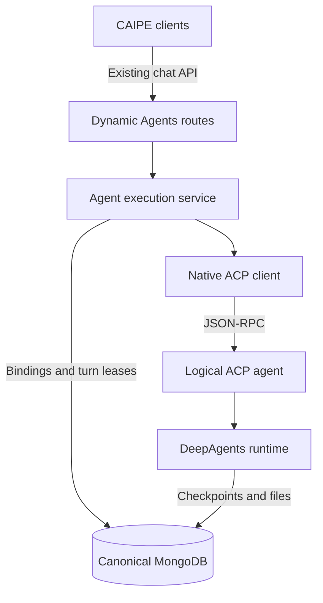

# Native ACP metaharness

The first implementation of the [CAIPE metaharness proposal](https://github.com/orgs/caipe-io/discussions/2877)
puts an Agent Client Protocol (ACP) boundary around the existing Dynamic Agents
runtime. Default and custom agents remain logical agents in the shared service;
DeepAgents and LangGraph still execute them.

## Execution path

The client and logical ACP agent exchange JSON-RPC messages inside the Dynamic
Agents service. This is a protocol boundary, rather than a new deployment or a
public ACP endpoint. The client negotiates capabilities before prompting the
agent and converts native progress back into the caller's existing stream.

| Boundary | Behavior in this implementation |
|---|---|
| Browser, bots and automation | Keep existing chat endpoints and AG-UI or custom SSE responses. No UI change is required. |
| ACP client and logical agent | Use the pinned `agent-client-protocol` Python SDK 0.12.1, released schema 1.19 and wire protocol 1. |
| Native feature preservation | Negotiate `caipe.io/native-acp` metadata and acknowledged `_caipe/event` requests carrying validated native stream events. Trace, turn and human-input resume context retain their runtime behavior. |
| Execution | Use the current agent runtime and MCP integrations; subagents remain native in-process delegation. |
| Workflows and triggers | Keep the current workflow engine, scheduler and autonomous trigger services, including their invoke and execution-context contracts. |

The execution service owns session admission, MCP resolution, runtime lifetime,
dispatch and state operations. HTTP routes retain authorization, request
validation and response translation. Streaming, human-input resume and invoke
share this service; conversation interrupt inspection, rewind, clear, restart
and cancellation use it as well.

LangGraph chunks are interpreted once into typed stream events. The native ACP
agent publishes standard ACP progress and acknowledged native events directly;
the client renders those events through the existing AG-UI or custom SSE
encoder. Direct rollback uses the same event projection and encoders. Neither
the agent nor the protocol bridge parses UI event strings to infer execution
state. Runtime construction, binding validation and administrative deletion
share one resolver for checkpoint and logical filesystem coordinates.

The bridge implements stable initialization, session creation, prompting,
updates and cancellation. It does not advertise ACP session loading, session
listing/forking, client filesystem access or terminal execution. Native
attachments and tool-produced files use the existing runtime and store. A new
protocol connection for a turn reuses the trusted native thread ID; it does
not recreate or replay the transcript through ACP.

The released SDK and native extensions preserve checkpointed forms and edited
batch tool approvals. Newer release-candidate elicitation capabilities do not
replace that lifecycle, so this stage does not depend on them. External
transport registration and additional harness backends remain later
extensions; an in-service native wrapper alone does not provide remote
pluggability.

The [Harness Engine discussion](https://github.com/orgs/caipe-io/discussions/2405)
describes a wider gateway and session-management foundation. This first stage
establishes the native ACP boundary and durable bindings while retaining the
current runtime. It does not introduce the proposal's remote runtime routing or
detached execution.

## Sessions and the canonical database

The admitted effective agent configuration and its session binding are stored
in `native_acp_sessions`, in the same configured MongoDB database as CAIPE
records and native checkpoints. The binding uses the agent ID and original
native session ID. It does not copy the checkpoint into a new history format
or store caller tokens and MCP credentials.

| State | Owner and persistence |
|---|---|
| Admitted agent configuration and execution binding | The native ACP integration stores the effective configuration snapshot and binding in `native_acp_sessions`. |
| Active-turn ownership | `native_acp_runs` stores an owned lease for each agent/session pair so multiple replicas coordinate admission and cancellation. |
| Native runtime state | LangGraph continues to use the existing checkpoint collections and thread IDs. DeepAgents files retain their existing storage namespace. |
| Interactive conversation messages and progress | The browser still writes the existing CAIPE conversation records through the BFF. |
| Workflow and automation history | Existing services keep their current history-writing responsibilities and execution-context mapping. |
| Active streaming and execution | Remain in the owning worker. Persisted bindings and leases do not provide detached-run reattachment or automatic recovery of a crashed run. |

Normal interactive conversation IDs and automated execution-context IDs keep
their existing relationship to LangGraph `thread_id`. New ACP bindings must not
rename those threads or invalidate existing checkpoints. Ordinary `/invoke`
continues to honor `INVOKE_PERSIST_HISTORY`; the ACP boundary does not make an
ephemeral invocation durable.

Admission acquires the turn lease before updating the binding or runtime
cache. A unique agent/session index permits one owner; the worker extends a
120-second lease and polls cancellation every second. Cancellation can reach
the owner even when its HTTP request lands on a different replica. Caller
identities, tokens and tool credentials are not stored in either ACP collection.

Workers need synchronized clocks. If a lease expires, another worker can
admit a later request using the existing native checkpoint. Expiry does not
automatically restart the previous run, replay lost stream events, or provide
exactly-once external tool effects. A stale worker is not fenced from an
external service by this MongoDB lease. Ephemeral `/invoke` uses transient
turn coordination while retaining its existing nonpersistent history behavior.

Starting a subsequent turn admits the latest effective agent configuration so
existing prompt, model and reasoning edits continue to work. The first
admitted backend/checkpoint/filesystem binding remains fixed. Human-input
resume restores the last admitted configuration after runtime-cache eviction,
including workflow overrides. Configuration snapshots have the same
sensitivity as agent definitions and need the same database access controls.
They are not a redaction layer for sensitive values placed in prompts or
middleware configuration. Changing the database, checkpoint collection or
file-store coordinates of an existing binding fails admission rather than
silently pointing the session at different state; migrate that state first.

Configure the UI and Dynamic Agents to use the same `MONGODB_URI` and
`MONGODB_DATABASE`. Include the new ACP collections and native checkpoint/file
collections in that database's existing backup and restore procedures. Restored
lease records can expire; they are not instructions to restart a run. The
implementation does not migrate transcripts
or consolidate databases that a deployment previously configured separately.

## Identity and filesystem boundaries

Existing authenticated caller identity, agent authorization and tool credential
delegation remain the admission boundary. ACP negotiation is not an
authorization grant. A caller must still have permission to use the agent and
the conversation or automated execution context.

Existing chat-management requests retain their BFF conversation authorization.
Stopping an active run keeps the existing cancellation semantics, including
when agent-use permission has been revoked. This stage adds no remote ACP
endpoint with a separate authentication contract.

Cached runtimes are refreshed when the admitted configuration, current caller,
client context or bearer changes. Each request therefore uses its current
authorization and tool credential context rather than retaining the caller who
first initialized the cache entry.

DeepAgents retains its logical filesystem, backed by its existing checkpoint or
MongoDB file store. The ACP wrapper does not grant access to the host filesystem
or create a per-agent sandbox. Existing tool-level network controls still apply;
ACP itself does not enforce an operating-system network policy.

Remote ACP transport, agent discovery across environments and sandbox policy
enforcement are later stages. Separate sandboxed runtimes will require enforced
filesystem and network boundaries before admission. This implementation does
not add OpenShell or NemoClaw execution.

## Enablement and rollback

`NATIVE_ACP_ENABLED=true` enables the native ACP path. Set it to `false` and
restart Dynamic Agents to use the existing direct runtime path. Both paths keep
the current chat API and checkpoint IDs; switching the flag does not delete
bindings, checkpoints or conversation records. Existing bindings still select
their admitted configuration and storage during direct rollback; unbound
legacy sessions do not create an ACP binding while the flag is disabled. Both
transports coordinate turns and state mutations through the same MongoDB
lease, including during a rolling change between enabled and disabled replicas.

See the [Dynamic Agents configuration reference](https://github.com/caipe-io/ai-platform-engineering/tree/main/ai_platform_engineering/dynamic_agents#configuration-reference)
for component settings.
