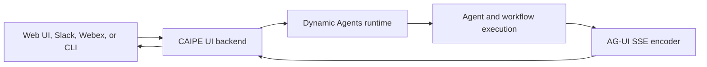

# Streaming Architecture

CAIPE streams agent responses and tool activity to its clients with
[AG-UI](https://docs.ag-ui.com/) events over Server-Sent Events (SSE). The
same stream powers the web UI, Slack, Webex, and the CAIPE CLI.

## Request path

Clients submit a prompt to the CAIPE UI backend or directly to the Dynamic
Agents service. The runtime loads the selected Agent Builder configuration,
executes the agent and its approved tools, and encodes progress as AG-UI
events. The client renders text, tool activity, interruptions, and completion
states as they arrive.



## How execution is selected

The runtime selects the execution path from the request and the configured
resource:

| Request | Execution behavior |
|---|---|
| Chat with an Agent Builder agent | Loads the agent's instructions, model, tools, knowledge, and skills, then runs the configured graph. |
| Workflow run | Executes ordered agent steps, passes context between steps, and pauses when approval or user input is required. |
| Tool call | Checks the caller's access before the approved MCP or built-in tool is run. |
| Resume after an interruption | Restores the run context and continues from the pending user or approval input. |

Agents can call approved MCP servers and built-in tools. AgentGateway and the
platform authorization layer enforce access to resources and tools; the
streaming layer does not grant permissions.

## AG-UI event lifecycle

The runtime emits a small set of events that clients can render incrementally:

| Event | Client behavior |
|---|---|
| `RUN_STARTED` | Create the active run and show that work has started. |
| `TEXT_MESSAGE_CONTENT` | Append the text delta to the current response. |
| `TOOL_CALL_START` | Show the tool currently being prepared or executed. |
| `TOOL_CALL_ARGS` | Update the visible tool input as arguments stream in. |
| `TOOL_CALL_END` | Mark the tool call as complete. |
| `TOOL_CALL_RESULT` | Display the tool result or its redacted error state. |
| `RUN_FINISHED` | Close the run, or show the form needed to resume after an interruption. |

Each event includes the run and thread identifiers needed to associate it with
the correct conversation. Clients should tolerate unknown event types so the
runtime can add non-breaking events in the future.

## Runtime endpoints

The Dynamic Agents API exposes AG-UI streams through these endpoints:

```text
POST /api/v1/chat/stream/start?protocol=agui
POST /api/v1/chat/stream/resume?protocol=agui
```

The CAIPE UI backend proxies authenticated browser requests and preserves the
user's identity when the runtime accesses tools, knowledge bases, or shared
agents. Slack and Webex use their corresponding server-side adapters and the
same runtime stream.

See the [Dynamic Agents & MCP API](../api/dynamic-agents-mcp.md) for request
and response details, and [UI features](../ui/features.md) for the behavior
users see in the web application.

## Reliability and interruptions

- The client can render the response as soon as the first text event arrives;
  it does not need to wait for the full answer.
- Tool events are separate from text events, so clients can show progress
  without mixing tool arguments into the assistant response.
- A human-approval or user-input interruption ends the current run with the
  information required to resume it.
- Failed tool calls are surfaced as structured errors and do not silently grant
  a different tool or permission.
- Run and thread identifiers allow clients to reconnect or resume the correct
  conversation.

## Troubleshooting

1. Confirm the Dynamic Agents service is healthy.
2. Confirm the request includes an accessible `agent_id` and a valid
   conversation or thread identifier.
3. Verify the client requests `protocol=agui` and accepts `text/event-stream`.
4. Check the runtime and UI backend logs for authorization or tool-call errors.
5. If the agent is not visible, check its enabled state, sharing settings, and
   the caller's permissions in Agent Builder.
