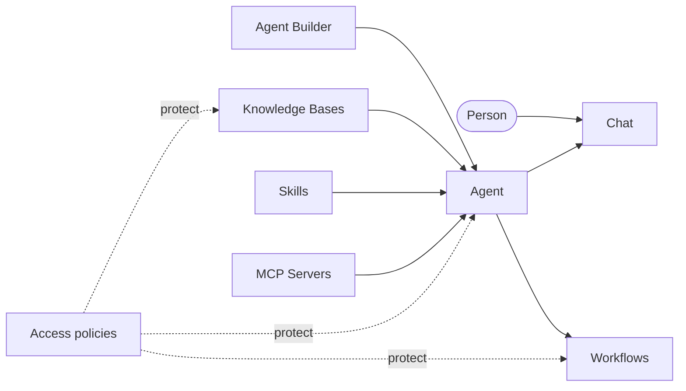

# Use CAIPE by task

CAIPE brings agents, tools, organizational knowledge, workflows, and access
controls into one workspace. Start with the outcome you want, then open the
focused guide for the feature.

## What do you want to do?

| Goal | Start here | What you will learn |
|---|---|---|
| Chat with an agent | [Getting Started](../getting-started/quick-start.md) | Start a conversation and choose the right client |
| Build an agent without application code | [Agent Builder](./agent-builder.md) | Define behavior, connect capabilities, test, and share an agent |
| Give an agent trusted organizational context | [Knowledge Bases](../knowledge_bases/index.md) | Add sources, search content, create collections, and control access |
| Automate a repeatable process | [Workflows](./workflows.md) | Chain agent steps, pass context, handle approvals, and inspect runs |
| Reuse instructions and procedures | [Skills](./skills/README.md) | Browse, import, scan, attach, and run reusable skills |
| Connect an independently deployed web experience | [External Apps](./agentic-apps.md) | Publish an app in the CAIPE Apps hub with scoped access |
| Connect tools and services | [MCP Servers](../agents/README.md) | Register MCP servers and expose approved tools to agents |
| Manage people, defaults, and platform health | [Settings and Admin](./admin-settings.md) | Configure personal preferences and administer the platform |
| Understand identity and access | [Security](../security/index.md) | Learn how sign-in, resource sharing, and policy checks work |

## How the features fit together

An agent is the reusable unit that brings these capabilities together. Agent
Builder defines what it should do; MCP servers provide approved tools;
Knowledge Bases provide governed context; Skills provide repeatable
instructions; and Workflows coordinate multi-step work. Access policies are
checked when people discover, use, or manage resources.

## Pick the right guide

- **For an evaluation:** use [Quick Start](../getting-started/quick-start.md),
  then try the [Agent Builder demo](./agent-builder.md).
- **For a team rollout:** start with [Helm deployment](../installation/helm.md),
  then configure [Security](../security/index.md) and [Settings and Admin](./admin-settings.md).
- **For a data-backed assistant:** configure [Knowledge Bases](../knowledge_bases/index.md)
  and attach a collection or source in Agent Builder.
- **For a developer integration:** read [External Apps](./agentic-apps.md),
  [MCP server development](../development/creating-mcp-server.md), or the
  [API reference](../api/index.md).

:::tip Feature availability

Some areas are optional or administrator-controlled. For example, Knowledge
Bases require the RAG services, external apps require an enabled catalog, and
some settings are visible only to administrators. If a feature is not visible,
check the deployment profile and your access permissions.

:::
