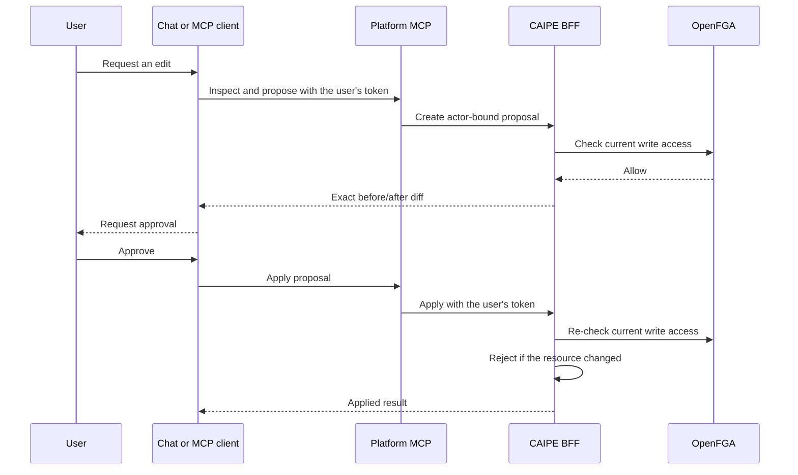

# Agent-assisted platform changes

The Platform MCP lets a person ask an agent to inspect and edit platform
configuration without giving the agent independent administrative authority.
It works from web chat, Slack, and external MCP clients such as Claude Code.

## Safety model

- A proposal never changes the target resource.
- Apply is always a separate, human-approved tool call.
- Authorization is checked when the proposal is created and again when it is
  applied.
- Proposals belong to the initiating human and expire after 24 hours.
- Concurrent edits invalidate a proposal instead of overwriting newer data.
- Ownership, visibility, team sharing, credentials, deletion, and agent
  creation remain in the canonical admin UI.
- Config-driven resources remain deployment-managed and cannot be edited.

## Slack identity behavior

Authorization follows the person who sent the current Slack message, not the
channel and not the bot's execution service account. A channel participant who
can chat with an agent but cannot manage it receives a denial. If a member of
the owning team asks for the edit in the same thread, CAIPE runs that request
with the team member's identity and can create a proposal for them.

Approval cards for mutating tools are ephemeral in public channels. Only the
requesting person sees and can approve the action.

## Supported resources

| Resource | Create | Update | Examples |
|---|---:|---:|---|
| Agent | No | Yes | Prompt, model, tools, skills, enabled state |
| Skill | Yes | Yes | Instructions, tasks, metadata, ancillary files |
| Workflow | Yes | Yes | Name, description, steps |
| Schedule | Yes | Yes | Agent, cron, timezone, message, enabled state |

## Feedback flow

Thumbs-down feedback can be recorded without changing anything. **Submit & Ask
Agent to Fix** also sends the feedback to the agent. If the text explicitly
asks for a configuration edit, the agent uses the same inspect, propose, diff,
and approval flow.

## External MCP clients

Connect an MCP client to the deployed AgentGateway path `/mcp/platform` and
authenticate with the user's normal bearer token. A local stdio client can run
`mcp-server-platform --transport stdio` with `CAIPE_API_URL` and a short-lived
user token in `CAIPE_ACCESS_TOKEN`.

Client-side tool confirmation should remain enabled for
`apply_platform_change`. The server also requires `confirmed: true` and
re-checks the caller's authorization before applying the proposal.
