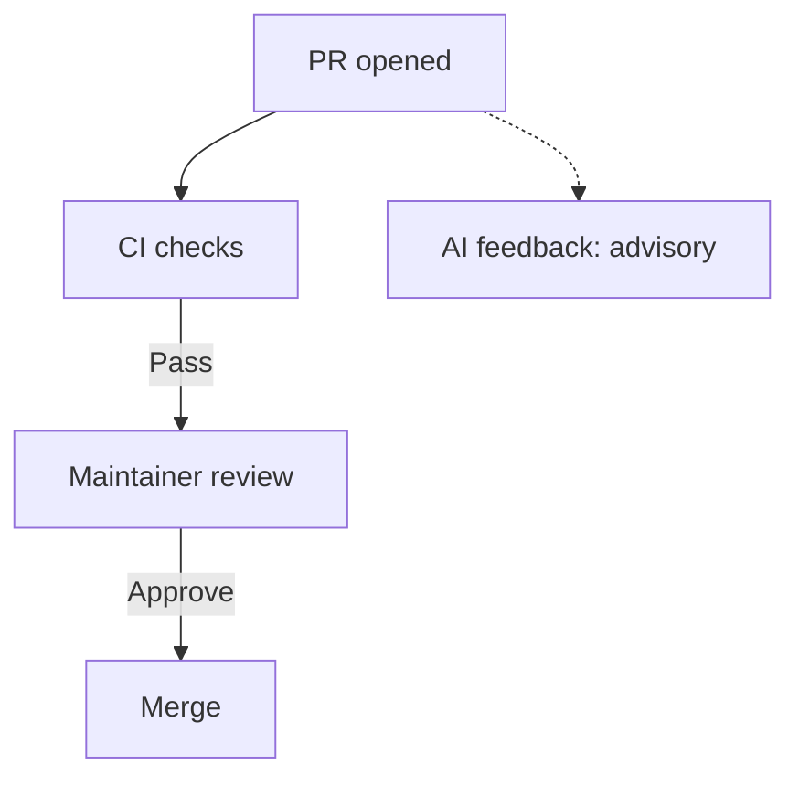

# Code Review

Who checks what, and what a pull request needs before it is approved.

## Three layers

| Layer | Owner | Covers |
|---|---|---|
| Mechanical | CI | formatting, lint, unit tests, secret scan, DCO, Conventional Commits, pinned actions, docs build |
| Structural | Human reviewer | correctness, architecture fit, security, failure modes, test value |
| Narrative | Author, read by the reviewer | why the change exists, what it affects, how it was verified |

Reviewers avoid repeating findings already reported by CI. If a reviewer finds a problem
that CI missed, they should report it and suggest an automated check where practical.

## Pull request size

- Aim for under 500 changed lines of hand-written code.
- Keep refactors in their own pull request, separate from behaviour changes.
- Generated content does not count — lockfiles, `helm-docs` chart READMEs, snapshots.
  Say in the description which part of the diff is generated.
- If a change cannot be split, say why in the description and name the order in which
  commits should be read.

Size is guidance, not a gate. No check blocks a pull request for being large.

### Automatic size labels

Every new or updated open PR, including forks and drafts, gets one `size/*` label.
Count additions plus deletions, excluding generated files; generated-only PRs are `size/XS`.

| Label | `XS` | `S` | `M` | `L` | `XL` | `XXL` |
|---|---|---|---|---|---|---|
| Changed lines | 0–9 | 10–29 | 30–99 | 100–499 | 500–999 | 1000+ |

- Definitions and generated-file globs:
  [`.github/pr-size/config.json`](https://github.com/caipe-io/ai-platform-engineering/blob/main/.github/pr-size/config.json).
  Excludes lockfiles, chart-root READMEs, generated Helm documentation pages, and snapshots.
- Labels are advisory: no bot comments or required size check. API errors are logged
  per PR without failing the labeling job or stopping the backfill.
- PRs above GitHub's 3,000-file API limit and incomplete file lists leave existing
  labels unchanged. Changes during labeling are retried up to three times.
- After merge, run **Actions → [Review] PR Size Label → Run workflow** on `main` once
  to backfill existing open PRs. Leave `pr_number` empty for all open PRs, or enter
  one PR number to retry it. Rerun after changing definitions or exclusions.
- The privileged workflow checks out the trusted workflow revision, never the PR
  head, and reads PR metadata through the API. It never executes PR code or artifacts.

## What a reviewer checks

**Structural**

- Does the change do what the description says, and only that?
- Is the canonical implementation reused? See the table in `AGENTS.md`.
- Failure modes: are errors handled with context, retries bounded, timeouts set?
- Do tests cover the behaviour that changed, not only the lines that changed?
- For Compose, chart, or `.env.example` changes: does the first-install path still work?

**Security**, as part of the structural pass

- Is new external input validated before use?
- Are auth, authorization, and audit helpers used through their existing boundaries
  rather than re-implemented?
- Does the change widen permissions, scopes, or network exposure? If so, is the wider
  grant necessary?
- Are new dependencies and actions pinned, and free of secrets or environment-specific
  identities?

**Narrative**

- Does the description say why, link the issue, and state how the change was verified?

Style preferences that no linter enforces are non-blocking comments. Say so when leaving
one.

## AI-assisted contributions

- Disclose AI assistance in the pull request description.
- The author is responsible for every line submitted, whatever produced it.
- Do not add AI co-author or `assisted-by` trailers. `Signed-off-by` is a human
  certification — see the DCO policy in `AGENTS.md`.

## Automated first pass

Maintainer review starts only after CI checks complete successfully. An AI reviewer
provides advisory feedback on non-draft pull requests and may run in parallel with
maintainer review.

- It is advisory. It never approves, never blocks a merge, and its review never counts
  as the maintainer approval.
- Authors should address relevant bot findings; maintainers may dismiss them.
- An unavailable or incomplete automated review does not delay human review or merge.
- Existing PR discussions about dismissed findings may inform the evaluation; no
  separate record is required.
- Its configuration lives in this repository: low-noise profile, `AGENTS.md` as its rule
  source, generated files excluded, drafts and `WIP` titles skipped.

Governance, before any such tool is enabled:

1. An install request naming the tool, the repository, and the permissions it needs.
2. A recorded assessment of its permissions, data handling, models, retention, and
   security certification.
3. A 90-day pilot, scoped to this repository.
4. After 90 days, maintainers decide whether to continue, adjust, or remove the tool using
   available vendor reports and existing PR discussions. Before starting the pilot,
   confirm which reports are included in the free OSS offering. Reviewers are not
   required to submit feedback or maintain additional records. Reported acceptance
   rates and estimated time savings are supporting indicators, not proof of improved
   review quality. If the available evidence is insufficient, record that limitation
   in the evaluation.

### CodeRabbit assessment

Published documentation checked on 2026-09-21. Confirm these details again before
installation; service terms and limits can change.

| Topic | Published facts and implications for CAIPE |
|---|---|
| Installation | An org owner can install the managed GitHub App for this repository only. Contributors do not need their own installation. [Source](https://docs.coderabbit.ai/platforms/github-com) |
| Permissions | Read access to Actions, discussions, members, metadata, and merge queues; read/write access to checks, code, commit statuses, issues, and PRs. Code-write access is broader than advisory review needs. Disabling automated edits does not remove that permission. [Source](https://docs.coderabbit.ai/platforms/github-com) |
| Code processing | CodeRabbit says code is shared with OpenAI and/or Anthropic for review and is not used for model training. These are vendor statements. [Source](https://docs.coderabbit.ai/faq) |
| Retention | Review caches expire within seven days; the documentation excludes OSS caches from its encryption guarantee. Caching can be disabled through `reviews.disable_cache` in repository configuration. Other stored review context and logs need separate assessment; seven days is not a universal retention limit. [Source](https://docs.coderabbit.ai/reference/caching) |
| Cost and limits | Current documentation offers Team features free for OSS, without a paid contributor subscription. Published OSS limits range from 1–10 PR reviews per developer/hour and 100–300 files per review, depending on the project, with fair-use adjustments. Confirm CAIPE's assigned limits before installation. [Source](https://docs.coderabbit.ai/management/plans) |
| Fit for CAIPE's volume | The epic records 136 merges in 30 days. That does not establish review demand: repeated pushes consume reviews, and large PRs may exceed file limits. The pilot should remain within the free offering. [Epic measurement](https://github.com/caipe-io/ai-platform-engineering/issues/2790) |

Before installation, the org owner confirms the requested permissions, applicable
data-retention terms, assigned OSS limits, and available reports. Any unresolved
limitations are recorded in the installation request.

## Approval

- One maintainer approval is required to merge.
- A bot review is never an approval.
- Address review feedback or reply explaining why not; do not leave threads unanswered.
- Apply review suggestions locally. Do not use GitHub's **Commit suggestion** button: the
  commit it creates names the suggestion's author as a co-author who has not signed off,
  so the DCO check fails.

## Review capacity

- Maintainers sweep pull requests with no review at least weekly. Each one gets a
  reviewer or a comment naming what blocks it.
- Stale handling is unchanged: the stale bot marks inactivity and closes after the
  configured grace period.

## Adoption status

| Item | State |
|---|---|
| This policy and checklist | in effect on merge |
| Pull request size guidance | in effect on merge |
| Size labels on pull requests | in effect on merge; existing PRs backfilled by manual workflow |
| Automated first pass | not yet — tool selection, assessment, and pilot pending |
| Backlog triage sweep | not yet — separate task |
