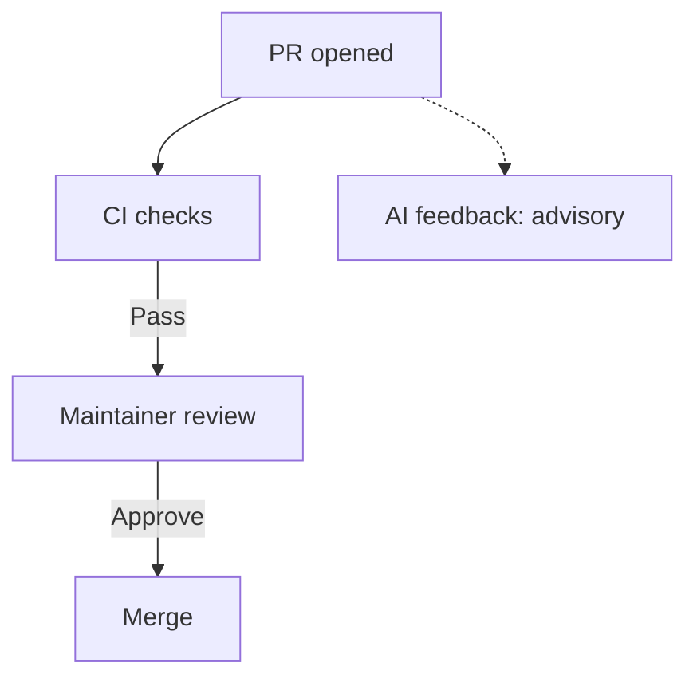

# Code Review

Who checks what, and what a pull request needs before it is approved.

## Three layers

| Layer | Owner | Covers |
|---|---|---|
| Mechanical | CI | formatting, lint, unit tests, secret scan, DCO, Conventional Commits, pinned actions, docs build |
| Structural | Human reviewer | correctness, architecture fit, security, failure modes, test value |
| Narrative | Author, read by the reviewer | why the change exists, what it affects, how it was verified |

Reviewers do not spend time on the mechanical layer. If a machine can catch it, a machine
catches it — a missing check is a CI gap, not a review comment.

## Pull request size

- Aim for under 500 changed lines of hand-written code.
- Keep refactors in their own pull request, separate from behaviour changes.
- Generated content does not count — lockfiles, `helm-docs` chart READMEs, snapshots.
  Say in the description which part of the diff is generated.
- If a change cannot be split, say why in the description and name the order in which
  commits should be read.

Size is guidance, not a gate. No check blocks a pull request for being large.

## What a reviewer checks

**Structural**

- Does the change do what the description says, and only that?
- Is the canonical implementation reused? See the table in `AGENTS.md`.
- Failure modes: are errors handled with context, retries bounded, timeouts set?
- Do tests cover the behaviour that changed, not only the lines that changed?
- For Compose, chart, or `.env.example` changes: does the first-install path still work?

**Security**, as part of the structural pass

- Is new external input validated before use?
- Are auth, authorization, and audit helpers used through their existing boundaries
  rather than re-implemented?
- Does the change widen permissions, scopes, or network exposure? If so, is the wider
  grant necessary?
- Are new dependencies and actions pinned, and free of secrets or environment-specific
  identities?

**Narrative**

- Does the description say why, link the issue, and state how the change was verified?

Style preferences that no linter enforces are non-blocking comments. Say so when leaving
one.

## AI-assisted contributions

- Disclose AI assistance in the pull request description.
- The author is responsible for every line submitted, whatever produced it.
- Do not add AI co-author or `assisted-by` trailers. `Signed-off-by` is a human
  certification — see the DCO policy in `AGENTS.md`.

## Automated first pass

Maintainer review starts only after CI checks complete successfully. An AI reviewer
provides advisory feedback on non-draft pull requests and may run in parallel with
maintainer review.

- It is advisory. It never approves, never blocks a merge, and its review never counts
  as the maintainer approval.
- Authors should address relevant bot findings; maintainers may dismiss them.
- An unavailable or incomplete automated review does not delay human review or merge.
- Dismissals are recorded as evaluation data.
- Its configuration lives in this repository: low-noise profile, `AGENTS.md` as its rule
  source, generated files excluded, drafts and `WIP` titles skipped.

Governance, before any such tool is enabled:

1. An install request naming the tool, the repository, and the permissions it needs.
2. A recorded assessment of its permissions, data handling, models, retention, and
   security certification.
3. A 90-day pilot, scoped to this repository.
4. An evaluation at the end of the pilot: continue, modify, or remove.

## Approval

- One maintainer approval is required to merge.
- A bot review is never an approval.
- Address review feedback or reply explaining why not; do not leave threads unanswered.
- Apply review suggestions locally. Do not use GitHub's **Commit suggestion** button: the
  commit it creates names the suggestion's author as a co-author who has not signed off,
  so the DCO check fails.

## Review capacity

- Maintainers sweep pull requests with no review at least weekly. Each one gets a
  reviewer or a comment naming what blocks it.
- Stale handling is unchanged: the stale bot marks inactivity and closes after the
  configured grace period.

## Adoption status

| Item | State |
|---|---|
| This policy and checklist | in effect on merge |
| Pull request size guidance | in effect on merge |
| Size labels on pull requests | not yet — separate task |
| Automated first pass | not yet — tool selection, assessment, and pilot pending |
| Backlog triage sweep | not yet — separate task |
