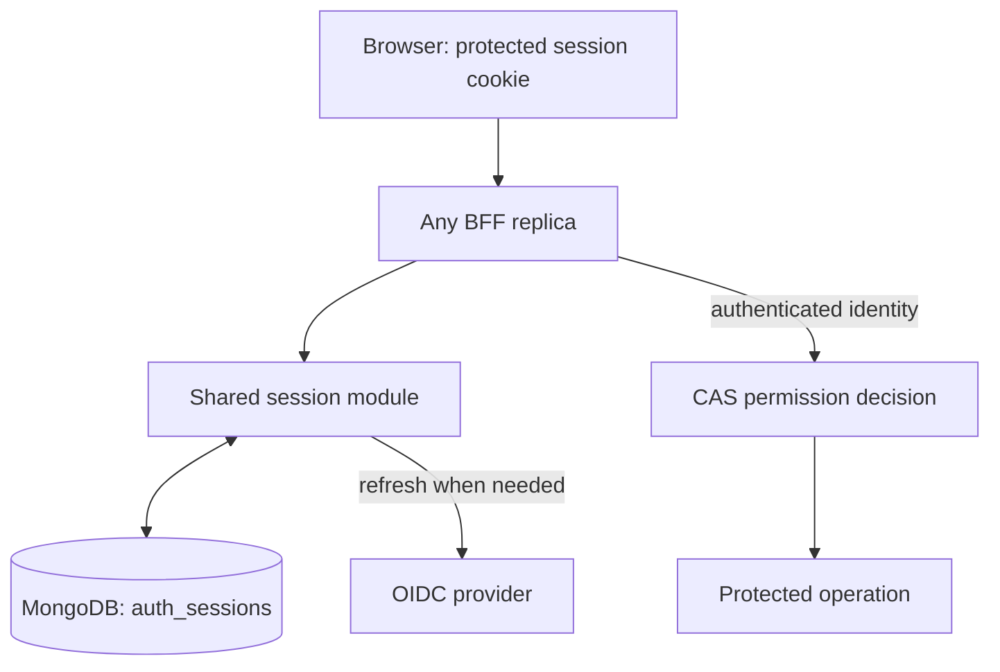

# Browser sessions across BFF replicas

Each login owns one encrypted MongoDB record. The browser cookie identifies that
login; it does not contain a second copy of its OAuth credentials or token expiry.

## Ownership

- **OIDC provider:** issues and refreshes credentials. Downstream validation remains required.
- **Session module:** stores token, expiry and version together; coordinates refresh.
- **CAS:** decides permissions, independently of session storage.
- **Caller:** enforces access before starting the operation.

The session ID identifies a login, **not a new user**. Two browsers have separate
records but the same Keycloak subject and existing grants. Browser chat and
workflow start/resume obtain credentials through the same NextAuth/BFF path.
Renewing credentials during a long-running workflow remains separate work.

## Consistency and failure behaviour

- Login waits for a majority-acknowledged write before issuing its cookie.
- Every credential read uses MongoDB primary/majority reads. There is no per-pod
  token cache or authenticated-session cache; the old cache TTL setting has no effect.
- Refresh takes a 30-second MongoDB lease. Other callers wait up to 12 seconds,
  then return a retryable error. A version/owner check rejects stale writes.
- A definitely retryable refresh rejection releases the lease and records a shared 30-second
  retry delay. The BFF rereads the session and can keep using its unexpired access
  token. Expired tokens, revoked sessions and database failures never use this fallback.
- Encoding a cookie never writes credentials. Logout cannot be undone by a late
  cookie response or refresh completion.
- A lost refresh response may mean the provider already rotated its token.
  After an abandoned lease, the next refresh requires sign-in instead of replaying
  that possibly consumed token. This is conservative recovery, not seamless recovery.
  Provider 5xx responses remain ambiguous, including JSON error bodies; the body
  alone is not treated as proof that no rotation occurred upstream.
- Missing/revoked/expired sessions return **401 / sign in** on the shared BFF path.
  Storage/refresh unavailability returns **503 / retry**, without clearing the cookie.
  Session errors expose no user identity, roles or credentials to direct session callers.
- Logout retains the cookie and reports failure if durable revocation fails. Normal
  NextAuth CSRF validation still runs before revocation.
  This revokes the BFF login, not already-issued provider tokens or running workflows.
- Sessions have an absolute **24-hour** lifetime. TTL indexes reclaim records;
  reads enforce expiry without waiting for MongoDB's TTL cleanup.

Legacy routes with their own error responses may still use a generic unauthorized
message. They do not receive a usable identity on session failure. Standardizing
those presentations is separate from the shared session/agent path.

## Rollout

- SSO requires `MONGODB_URI`, `MONGODB_DATABASE`, and a common `NEXTAUTH_SECRET`
  across BFF replicas. Credentials use AES-256-GCM with a key derived from that
  secret and are bound to the session ID and subject.
- **Existing cookies are rejected. Users must sign in again.** There is no old-format
  fallback and no grant or user-ID migration.
- Coordinate the BFF cutover; do not serve traffic with mixed old/new session
  implementations. Rollback requires an explicit session reset as well.
- Old `auth_token_cache` records are no longer read and age out via their existing TTL.
- Anonymous/local development mode remains unchanged. API bearer-token validation
  and permission models are unchanged.

## Validation

- Login on one replica, immediately use chat/workflow on another.
- Concurrent refresh, two browsers for one user, revoked-cookie replay, logout
  racing with refresh, expiry, database failure and abandoned leases.
- CI creates real server-side sessions for browser tests; the production decoder
  has no special test-cookie bypass.
- `auth-token-store.test.ts` covers isolated replicas with a database double.
  `auth-session-mongo.test.ts` exercises atomic writes against real MongoDB when
  `AUTH_SESSION_TEST_MONGODB_URI` is set; it creates and removes its own random test database.

The extra shared reads are an intentional consistency baseline. Measure latency
before considering a cache with explicit invalidation.
