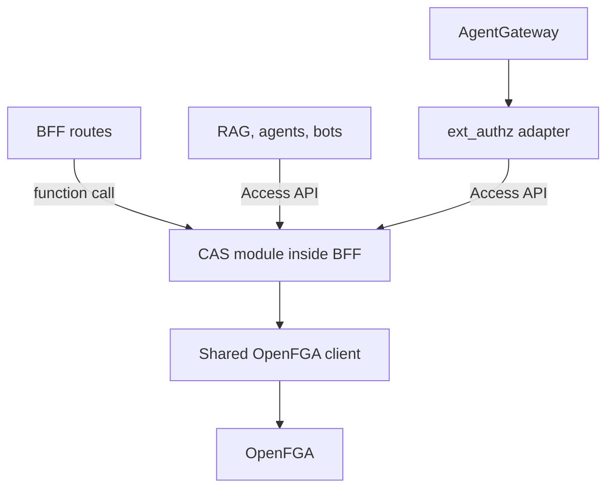

# Access API: one authorization boundary

**Status:** Access API foundation implemented; BFF chat agent-use guard migrated
to in-process CAS. Remote consumers are not migrated yet.

CAS answers permission questions. Each service still stops an operation when
the answer is no. CAS is a module inside the BFF, not another deployed service.

## Target architecture



This is the destination, not today's complete wiring. The new `/api/access/*`
routes and the shared BFF agent-use guard call CAS now. Existing `/api/authz/v1/*` callers, direct service clients
and the gateway bridge are unchanged. Migrating them is separate work, not a
commitment to maintain two public contracts permanently.

## The foundation

| Operation | Question |
| --- | --- |
| `POST /api/access/check` | May I perform this action on this resource? |
| `POST /api/access/query` | Which of these candidate resources may I access? |
| `POST /api/access/grants` | May I give this principal a capability? |
| `DELETE /api/access/grants` | May I remove this principal's capability? |

- The caller comes from existing bearer-token or session authentication.
  A service token evaluates the service's own access, not its owner's access.
- Requests cannot supply a subject, delegated identity or trusted context.
  Cookie requests require the same browser origin and JSON content.
- Checks return allow or deny. An unavailable decision returns an error;
  callers must not treat it as permission to proceed.
- Queries filter at most 200 supplied IDs using the same per-resource CAS
  policy as checks. Any unavailable result fails the whole query.
- Grant/revoke uses the existing CAS rule: manage the resource, or manage
  the configured organization. Public-grant restrictions and auditing remain
  in place. Revoking a direct grant does not remove access inherited elsewhere.

The routes contain no OpenFGA calls or independent permission rules. The
shared HTTP boundary handles authentication, validation and error responses;
CAS owns the decisions and changes to relationships.

## What this does not solve yet

- Normalized identity and verified delegation across every ingress.
- Migration of gateway, RAG, bots and older BFF authorization paths.
- Resource registration, unbounded discovery or a generic resource catalog.
- System-wide model pinning, bounded dependency calls and revocation freshness.
  Single agent-use checks are fresh; other decision and query caches still apply.
  HTTP `no-store` does not disable those caches.

## BFF agent execution

```text
Chat routes → existing agent-use guard → CAS → OpenFGA
              validate + enforce       decide + audit
```

- Seven calls across six route files include interactive and scheduled-owner
  execution. Conversation checks and scheduled-owner token exchange are unchanged.
- Human and service-account checks use their canonical Keycloak IDs. The guard
  no longer retries with email or enumerates teams; OpenFGA follows team relations.
  Email-only grants no longer authorize this path. Existing tuples are untouched.
- Single CAS `agent/use` checks skip the BFF decision cache, request higher
  consistency, and have a five-second dependency budget including discovery.
  A definitive answer has `ttl_seconds: 0`. Dependency failures return unavailable,
  not allow; the legacy unsafe bypass is not honored.
- CAS records the decision. The guard preserves its 401/400/403/503 envelopes
  and passes tracing metadata without emitting a second legacy decision event.

Picker filtering, membership writes, seed identity cleanup and other services
remain separate migrations. Fresh checks cannot repair a missing relationship
write or cancel a run that has already started.

Moving remote consumers onto CAS makes BFF latency and availability part of
their authorization path. Prove that behavior before migrating them. Enforcement
must remain in each service, including when clients bypass the browser.

## Implementation and next step

The contract, examples and failure semantics are in
[`ui/src/lib/authz/README.md`](https://github.com/caipe-io/ai-platform-engineering/blob/main/ui/src/lib/authz/README.md).
Request/response types live in `ui/src/lib/authz/access-contract.ts`.

Next, migrate one complete agent-access journey: its checks, visible-resource
queries and grant/revoke operations. Verify that selection agrees with execution,
then remove that journey's obsolete authorization path.
