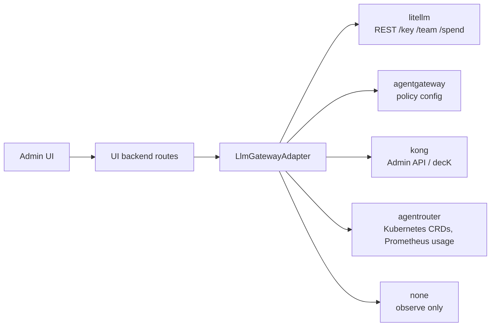

# Contract ⑤: Gateway Adapter (control plane)

The UI backend talks to the gateway's admin API only through this interface. One implementation per gateway. The UI renders only what `capabilities()` declares.

| Operation | Input | Output | Used by |
|---|---|---|---|
| `capabilities()` | — | capability set ([data-model.md §6](../data-model.md)) | UI |
| `list_models()` | — | models served by the gateway | `llm_models` sync |
| `ensure_principal(p)` | user, agent or team | idempotent | agent create, default team at startup, first call |
| `set_limit(p, limit)` | principal + `{limit_type, amount, window}` | applied limit | admin, quota approval |
| `get_usage(p, window)` | principal + window | spend / tokens / remaining | admin, end-user budget display |

## Rules

- **Idempotent**: every write can be retried safely.
- **No CAIPE copy**: limits and usage are read live. A short in-memory cache only.
- **Unsupported → `NotSupported`**: the UI hides the control. It never fails silently.
- **Credentials**: the adapter's admin credential is held only by the UI backend, through the existing secret strategies.
- **Authorization**: every adapter route is gated by OpenFGA (org or team admin for writes; self, team or agent viewers for reads).
- **`none` adapter**: all writes are `NotSupported`; `capabilities()` is empty. Data-plane contracts ①–④ still apply with either auth mode. Key auth uses keys provisioned in the gateway by the operator and saved in CAIPE's credentials store; `keys.issue` is not required.
- **Budget-signal rule**: named adapters ship documented rules that distinguish gateway limits from provider errors; adapter `none` requires operator configuration. Rules are used by the data plane ([openai-endpoint.md](./openai-endpoint.md)).
