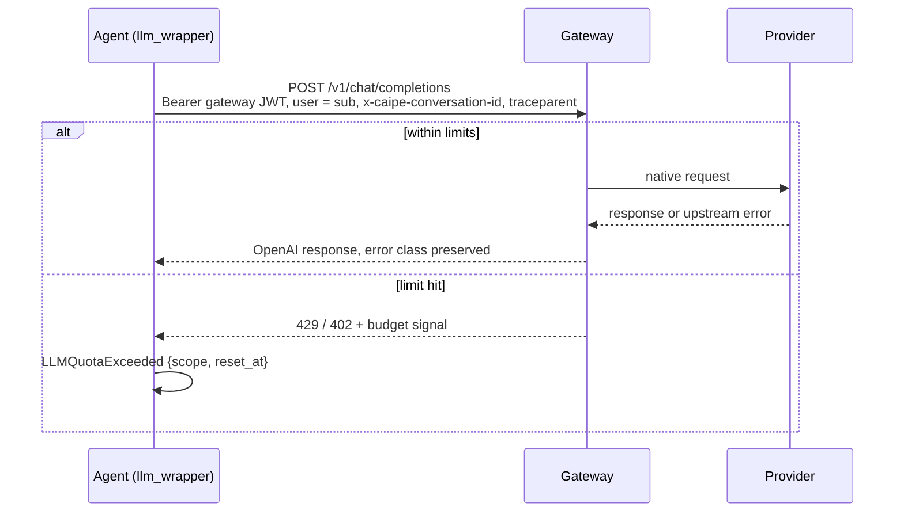

# Contract ①③④: Agent ↔ Gateway (data plane)

What every agent sends and what every gateway must honour. Agents reach the gateway through the `openai-compatible` provider in `ai_platform_engineering/llm_wrapper/` (`OPENAI_COMPATIBLE_BASE_URL`).

## Request

- **Transport**: HTTPS (in-cluster HTTP only behind network policy).
- **Paths**: `POST /v1/chat/completions` (streaming SSE, tool calls), `GET /v1/models`, `POST /v1/embeddings`.
- **Auth ②**: `Authorization: Bearer <gateway JWT>` (`LLM_GATEWAY_AUTH=jwt`), or `Bearer <per-agent gateway key>` (`LLM_GATEWAY_AUTH=key`). See [routing-backend-contract.md](./routing-backend-contract.md).
- **Body**: OpenAI chat-completions schema. `model` = `llm_models.model_id`.
- **Attribution ③**:

| Field | Value |
|---|---|
| body `user` | token `sub` |
| `x-caipe-conversation-id` | conversation id |
| `traceparent` | W3C trace context |

- With JWT auth, identity is trusted **only** from the token, never from headers.

## Response

- **Success**: OpenAI schema, translated from the real upstream.
- **Upstream error**: class preserved (429 stays 429, 5xx stays 5xx). No retry by CAIPE.
- **Budget / quota rejection ④**: confirmed by a budget-signal rule identifying a gateway-enforced limit → `LLMQuotaExceeded`.

| CAIPE error field | Source |
|---|---|
| `scope` | `user` · `agent` · `team` (from the rule, else `unknown`) |
| `reset_at` | `Retry-After` or gateway body, if present |
| `message` | "Budget for <scope> exhausted, resets <when>. Request an increase." |

- Budget-signal rules are declarative data: documented defaults for named adapters, overridable with `LLM_GATEWAY_BUDGET_SIGNAL`. A rule must match a gateway header, structured error code or unambiguous configured pattern that distinguishes a gateway-enforced limit from a forwarded provider error. HTTP 402/429 or the words "budget" and "quota" alone are insufficient.
- Adapter `none` has no default rule. Operators must configure a rule for their gateway before budget-error conformance can pass.
- Unmatched or ambiguous errors retain their original status and classification, without an inferred budget scope or budget-increase advice. This also applies when no rule is configured; the request remains rejected.
- **Gateway unreachable**: fail closed and name the gateway. No direct-provider fallback.

## Invariants

- No agent source change. Swapping gateways = changing the endpoint and adapter.
- Behaviour matches a direct call apart from the hop. Latency is measured, not bounded.
