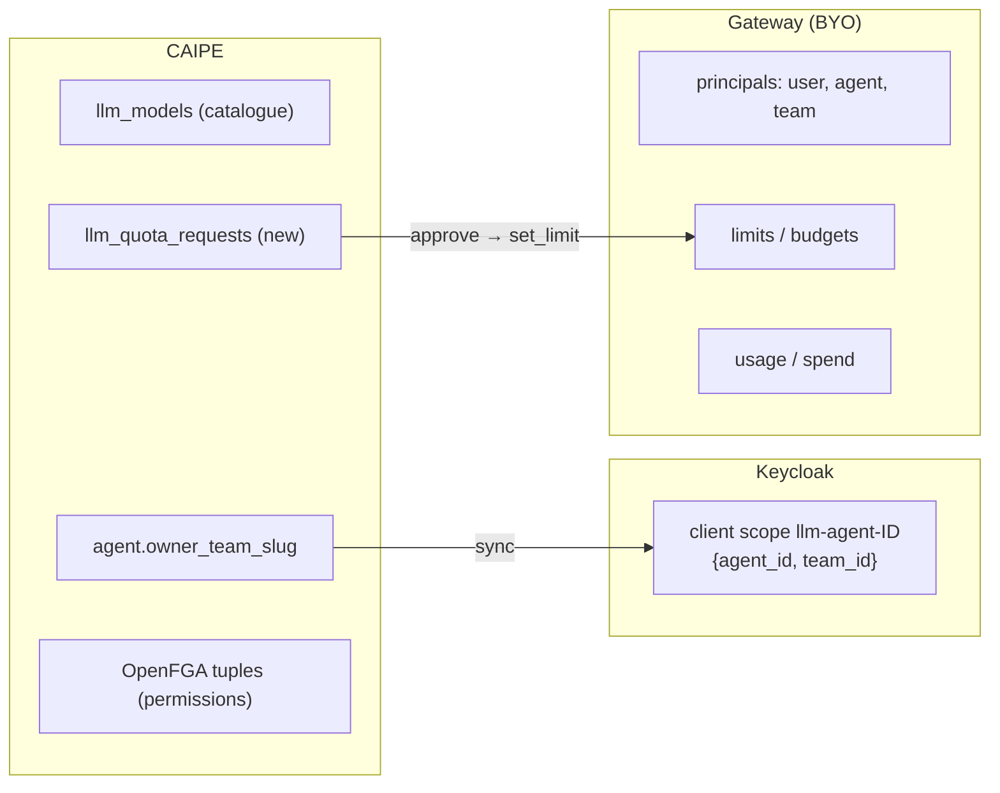

# Data Model: Centralise LLM Routing, Quotas and Budgets

One new Mongo collection and one Keycloak object per agent. Limits and usage stay in the gateway.

## 1. Deployment settings

| Setting | Default | Meaning |
|---|---|---|
| `LLM_GATEWAY_ENABLED` | `false` | Global routing switch. `false` uses direct-provider configuration and bypasses the gateway even when configured and reachable; `true` routes migrated paths through the gateway and fails closed on gateway failure. |
| `OPENAI_COMPATIBLE_BASE_URL` | — | Gateway endpoint (from `llm_wrapper`). |
| `LLM_GATEWAY_AUTH` | `jwt` | `jwt` (gateway token) · `key` (per-agent gateway key). A gateway property, independent of the adapter. |
| `LLM_GATEWAY_AUDIENCE` | `llm-gateway` | `aud` of gateway tokens. The gateway must expect the same value. |
| `LLM_GATEWAY_ADAPTER` | `none` | `litellm` · `agentgateway` · `kong` · `agentrouter` · `none` |
| `LLM_GATEWAY_DEFAULT_TEAM` | `platform` | Team charged for agents without `owner_team_slug`. Provisioned at startup. |
| `LLM_GATEWAY_BUDGET_SIGNAL` | named adapter default; unset for `none` | Gateway-limit recognition rule (research Decision 10). Required for budget-error conformance with adapter `none`. |
| Adapter admin credential | — | Through the existing secret strategies. Only needed by the UI backend. |

Direct-provider configuration and credentials must remain available for disabled mode; configuring a gateway endpoint alone does not enable routing.

## 2. `llm_models` (existing collection, additive fields)

| Field | Existing? | Meaning |
|---|---|---|
| `model_id` | ✓ | Same value the gateway alias uses. Unchanged for existing rows. |
| `name`, `provider`, `description` | ✓ | Unchanged. |
| `source` | new | `seed` · `admin` · `gateway` |
| `gateway_synced_at` | new | Time of the last `list_models` sync. |

- **Rule**: when `LLM_GATEWAY_ENABLED=true`, `build_chat_model` uses the `openai-compatible` provider with `model_id`, whatever `provider` the caller passes.

## 3. Gateway token (JWT, not stored)

| Claim | Example | Source |
|---|---|---|
| `iss` | `https://idp.example.com/realms/caipe` | signer |
| `aud` | `LLM_GATEWAY_AUDIENCE` | setting |
| `sub` | user or task-owner subject (effective principal) | caller token / trusted run binding (#2891) |
| `act` | `{"sub": "service-account-dynamic-agents"}` | acting service (#2885) |
| `org` | `example-org` | existing `org` claim (budget key namespace) |
| `agent_id` | `agent-example` | Keycloak scope ([K2](./research.md#identity-option-legend)) or signer ([C1](./research.md#identity-option-legend)) |
| `team_id` | `team-example` | agent `owner_team_slug`, else `LLM_GATEWAY_DEFAULT_TEAM` |
| `exp` | ≤ 5 min | signer |

- Cache key: (`sub`, `agent_id`, `owner_team_slug`). An owner-team change misses the cache.
- Caller kind (user, service account, autonomous) is an OTel label set by the runtime, not a claim.

## 4. Agent scope (Keycloak, [K2](./research.md#identity-option-legend) only)

| Field | Value |
|---|---|
| name | `llm-agent-<agent_id>` |
| mappers | hardcoded claims `agent_id`, `team_id` |
| assigned to | dynamic-agents exchanger client (optional scope) |
| lifecycle | created with the agent; `team_id` updated before an owner-team change is saved; deleted with the agent |

## 5. `llm_quota_requests` (new Mongo collection)

| Field | Meaning |
|---|---|
| `scope` | `user` · `agent` · `team` |
| `principal_id` | subject, agent id or team slug |
| `requested_by` | subject |
| `requested_limit`, `reason` | the ask |
| `status` | `pending` · `approved` · `rejected` |
| `decided_by`, `decided_at` | approver |
| `created_at` | — |

- On approval, the UI backend calls `set_limit` on the adapter. The gateway holds the result.

## 6. Adapter capabilities (not stored)

Capabilities describe the gateway's **admin API** only. Auth mode is `LLM_GATEWAY_AUTH`.

| Capability | Meaning |
|---|---|
| `models.list` | can sync `/v1/models` |
| `principals.ensure` | must pre-create a user, agent or team before first use |
| `limits.user` / `limits.agent` / `limits.team` | can set a limit per dimension |
| `limits.budget_usd` / `limits.tokens` / `limits.rpm` | supported limit types |
| `usage.read` | can return spend or usage per principal |
| `keys.issue` | can issue per-agent keys; required only for automated key provisioning through CAIPE |

- Key authentication requires a valid per-agent gateway key in CAIPE's credentials store. Operator-provisioned keys work without `keys.issue`, including with adapter `none`.
