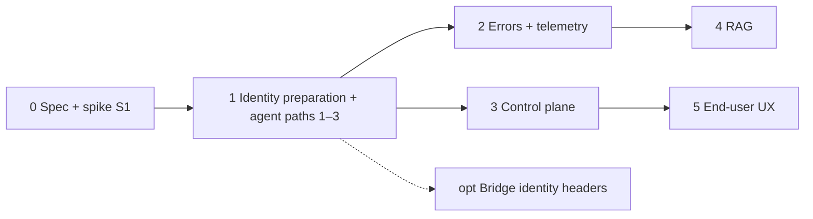

# Plan: Centralise LLM Routing, Quotas and Budgets

**Spec**: [spec.md](./spec.md)

**Issue**: #2874

**Epic**: #2537

This PR delivers the **spec/ADR only**. Implementation lands as separate PRs under Epic #2537 (see [tasks.md](./tasks.md)).

## Summary

- Agents use any OpenAI-compatible gateway through the `openai-compatible` provider (`llm_wrapper`).
- Every call carries a short-lived JWT naming the user, agent and owning team. The gateway enforces limits and meters usage.
- The UI backend manages models, limits and usage through a capability-flagged adapter.
- No bundled gateway. One global switch, `LLM_GATEWAY_ENABLED`, is off by default.

## Phases

Phases describe delivery order. One global switch controls gateway routing across all migrated paths: `LLM_GATEWAY_ENABLED=false` uses direct-provider configuration and bypasses the gateway even when configured and reachable. Valid direct-provider configuration and credentials must remain available. With the switch on, gateway failures fail closed without automatic direct-provider fallback. Rolling back an individual phase requires reverting the relevant deployment or code changes while respecting phase dependencies.

| Phase | Delivers | Main code | Gate |
|---|---|---|---|
| 0 | Spec/ADR (this PR) + spike S1 | `docs/`, Keycloak spike | approval |
| 1 | Identity setup and lifecycle for existing/new agents, default team; routing and authorization for agent paths 1–3 | `llm_wrapper/src/llm_wrapper/build.py`, `dynamic_agents/services/{llm_clients,llm}.py`, `dynamic_agents/auth/authz.py`, `ui/src/lib/rbac/keycloak-admin.ts`, agent lifecycle routes | S1 decides [K2](./research.md#identity-option-legend) or [C1](./research.md#identity-option-legend); #1753; identity readiness before routing (see [tasks](./tasks.md#phase-1-identity-preparation-and-agent-data-plane)) |
| 2 | Budget-signal rules ④ + attribution ③ + OTel GenAI | `llm_wrapper`, `dynamic_agents` | phase 1 |
| 3 | Control plane: adapter, automated gateway principal provisioning, `llm_models` sync, admin limits/usage UI | `ui/src/app/api/`, `ui/src/lib/`, `ui/src/lib/rbac/keycloak-admin.ts` | phase 1 |
| 4 | RAG paths 4–5 (same embedding model id only) | `knowledge_bases/rag/` | phases 1–2 |
| 5 | End-user UX: remaining budget, quota requests | `ui/`, bots (message text only) | phase 3 |
| opt | OpenFGA bridge returns verified identity headers for gateways with ext_authz | `deploy/openfga/bridge/` | phase 1 |

**Implementation completion gate (SC-007):** the [required conformance task T060](./tasks.md#required-validation) must pass all applicable checks for every in-scope path against at least two different gateways, with versions, authentication modes and results recorded. This gate applies to the implemented feature; it does not block merging this spec/ADR.

## Constitution check

| Principle | Assessment |
|---|---|
| Worse is Better / YAGNI | No bundled gateway, no in-process router, no CAIPE copy of limits. |
| Composition over Inheritance | Gateways sit behind fixed contracts plus an adapter. |
| Security by Default | Per-call verifiable identity, no provider or admin keys in agents, fail closed. |
| Single source of truth | Gateway for limits and usage; OpenFGA for access; Mongo for catalogue and requests. |
| Docker Compose first install | Default profile unchanged; the switch is off by default. |

## Risks

| Risk | Mitigation |
|---|---|
| Keycloak can't emit per-agent scope claims at scale | Spike S1; fall back to [C1](./research.md#identity-option-legend) (dynamic agents sign) |
| Gateway licence tiers lack JWT or budgets | `LLM_GATEWAY_AUTH=key`; adapter `none` |
| Shared agents drain the owning team's budget | Per-user limit on top (T1) |
| Embedding model drift invalidates indexes | Phase 4 only moves if the model id is identical |
| Gateway outage stops all LLM traffic | Fail closed with a clear error; the switch restores direct calls |
| Signer change resets budgets | Budget keys use `org` + principal, never `iss` |
| ACP runtime refactor (#2883) moves call sites | The hook lives in `llm_wrapper`, below the runtime |
