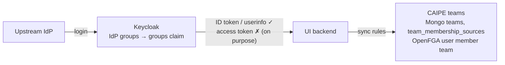
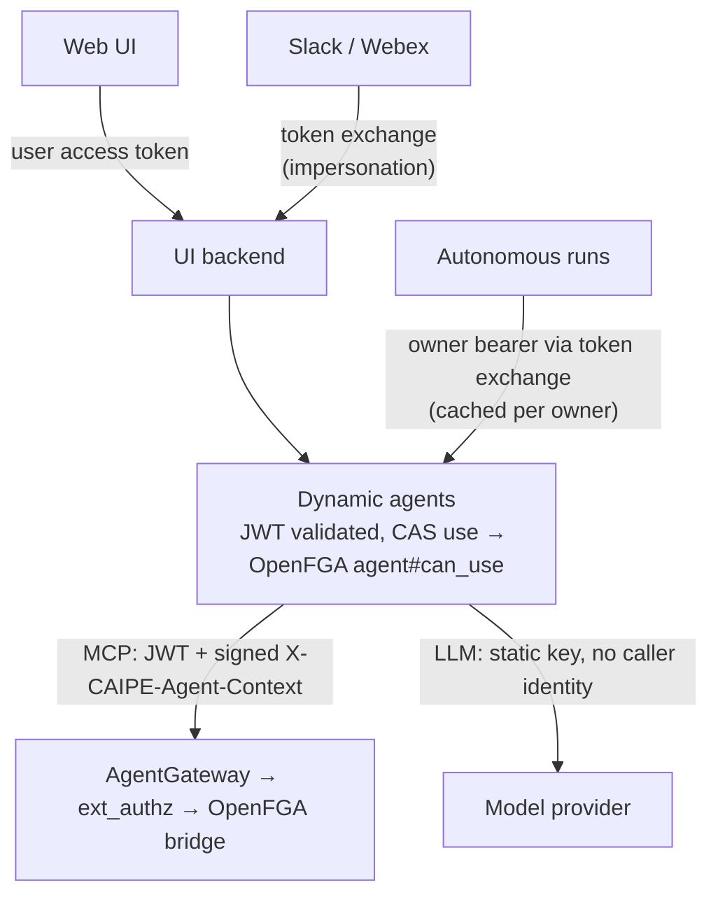
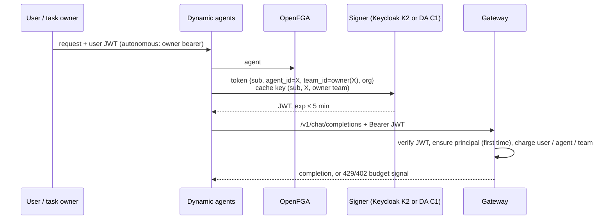
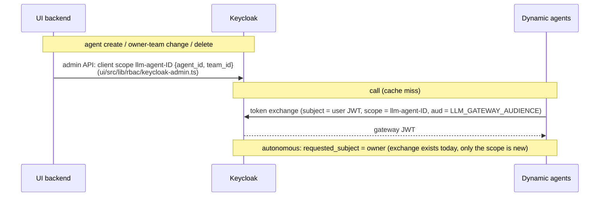

# Research: Centralise LLM Routing, Quotas and Budgets

## Decision 1 — Bring your own gateway; contracts instead of a product

- Gateways agree on **inference** (OpenAI-compatible) but differ in **administration** (auth, budgets, usage).
- So CAIPE fixes the data-plane contracts ①–④ and wraps the control plane ⑤ in a capability-flagged adapter.

| | LiteLLM | AgentGateway (`agentgateway.dev`) | Kong AI Gateway | AgentRouter (Envoy AI Gateway) |
|---|---|---|---|---|
| ① OpenAI wire | native | OpenAI-compatible LLM backends | `ai-proxy` (OpenAI format) | native; also `/v1/embeddings`, `/anthropic/v1/messages` |
| ② JWT validation | `enable_jwt_auth`, `user_id_jwt_field`, `team_id_jwt_field` | listener `jwtAuth` (already used for MCP) | `openid-connect` → consumer groups | Envoy Gateway `SecurityPolicy` JWT (JWKS); claims copied to headers |
| Budgets / quotas | `max_budget`, tpm/rpm per key, user and team | token and $ budget limits keyed on claims | `ai-rate-limiting-advanced` per consumer or group | token limits (not $) keyed on claim headers × model, CEL cost; `QuotaPolicy` per backend |
| ⑤ Admin API | REST `/key`, `/team`, `/spend` | config / K8s policy | Admin API / decK | none; Kubernetes CRDs only |
| Usage | `/spend`, Prometheus | OTel | Prometheus / OTel | OTel GenAI metrics, Prometheus |
| ext_authz callout | custom auth hook | native `extAuthz` | plugin | native (Envoy ext_authz) |

- Licence tiers for the JWT and budget features in LiteLLM and Kong must be confirmed per deployment. Where they're missing, use key auth (Decision 6).
- **AgentRouter** is Envoy AI Gateway, renamed and donated to the Agentic AI Foundation. It is not the `agentgateway` CAIPE already runs for MCP. It is pre-1.0 (v1alpha CRDs).
- AgentRouter caveats:
  - Budgets are tokens, with no dollar ledger.
  - Usage is charged when the response ends, so a stream can overshoot.
  - `QuotaPolicy` fails open by default. Set `quotaRateLimitFailureModeDeny=true`.
  - Needs Redis and a rate-limit service.
  - Limits are CRDs, so its adapter writes through the Kubernetes API or stays `none`.
- Sources:
  - [LiteLLM JWT auth](https://docs.litellm.ai/docs/proxy/token_auth)
  - [LiteLLM JWT → virtual keys](https://docs.litellm.ai/docs/proxy/jwt_key_mapping)
  - [AgentGateway budgets](https://agentgateway.dev/docs/standalone/latest/llm/cost-controls/budget-limits/)
  - [Kong AI Rate Limiting Advanced](https://developer.konghq.com/plugins/ai-rate-limiting-advanced/)
  - [AgentRouter](https://github.com/theagentrouter/agent-router): usage-based rate limiting, quota policy, security, observability

## Decision 2 — Code scope: who calls an LLM today

| # | Caller | Code | Model chosen by |
|---|---|---|---|
| 1 | Agent and subagents | `dynamic_agents/services/agent_runtime.py` → `services/llm_clients.get_llm` | `llm_models` |
| 2 | Agent middleware | `dynamic_agents/services/middleware.py` → `services/llm.get_configured_llm` | middleware params |
| 3 | AI-assist `/suggest` | `dynamic_agents/routes/assistant.py` (provider from the request) | `llm_models` (UI picks) |
| 4 | RAG embeddings | `knowledge_bases/rag/common/src/common/embeddings_factory.py` | env |
| 5 | RAG ontology agent | `knowledge_bases/rag/agent_ontology/src/agent_ontology/agent.py` | env |

- Paths 1–3 all build models through `build_chat_model` in `ai_platform_engineering/llm_wrapper/src/llm_wrapper/build.py`. The switch, the provider override and the auth hook live there, so no caller can bypass them.
- Bots, autonomous agents, the scheduler and the UI have no LLM client of their own. They inherit through dynamic agents.

## Decision 3 — Rollout: phased build, one global switch

| | Single release | **Phased (chosen)** |
|---|---|---|
| Blast radius | every LLM call and RAG ingest | one call path per phase |
| Test matrix | 5 paths × N gateways | 1 path × N gateways |
| Rollback | revert the release | disable gateway routing globally; revert deployment/code changes for an individual phase |

| Switch option | Pros | Cons |
|---|---|---|
| Per-model opt-in | per-agent canary | budgets can be bypassed via direct models |
| **Global switch (chosen)** | uniform enforcement | needs gateway aliases = existing `model_id` |
| Per-model, then enforce | gradual, then strict | two mechanisms |

The phases are delivery stages, with no phase-specific switches. `LLM_GATEWAY_ENABLED=false` bypasses the gateway for every migrated path even when its endpoint is configured and reachable; direct-provider configuration and credentials must remain available. With routing enabled, gateway failures fail closed. Individual phase rollback requires reverting deployment or code changes while respecting dependencies.

## Decision 4 — Identity facts today

| Dimension | Where it lives | In the access token? |
|---|---|---|
| user | `sub` | ✓ |
| service account | `preferred_username = service-account-*` | ✓ |
| agent | HMAC header `X-CAIPE-Agent-Context` (`dynamic_agents/services/mcp_client.py`) | ✗ |
| team | Mongo / OpenFGA | ✗ |
| organization | single-valued `org` claim; one tenant per deployment | ✓ |

- Autonomous runs mint a short-lived owner bearer through token exchange (`autonomous_agents/.../dynamic_agents_client.py`). `X-User-Context` still carries attribution; dynamic agents stop trusting it with #1753.
- Dynamic agents already request the CAS action `use` on an agent, which maps to the OpenFGA relation `agent#can_use`, at the start of each turn (`dynamic_agents/auth/authz.py` `require_agent_use_permission`), for interactive and autonomous runs.

## Decision 5 — Which team pays: **T1, the agent's owning team**

| Rule | Pros | Cons |
|---|---|---|
| **T1 Owning team (chosen)** | `owner_team_slug` already exists; deterministic in UI, bots and autonomous runs | shared agents bill their owner; mitigated by the per-user limit |
| T2 Caller's context team | fair allocation | needs an "active team" concept and a UI selector |
| T3 Caller's home team | stable | needs a "primary" designation |
| T4 All of the caller's teams | strict | double-counts |
| T5 Hybrid | fair for global agents | two rules |

- T1 makes `team_id` a constant per agent. That is what allows Decision 7.
- Agents with no owning team use `LLM_GATEWAY_DEFAULT_TEAM` (`platform`).

## Decision 6 — How identity reaches the gateway: **a short-lived JWT, with key auth as fallback**

| Option | User | Agent | Team | Any gateway | Verdict |
|---|---|---|---|---|---|
| A. Sync teams into Keycloak groups | ✓ | ✗ | ✓ | JWT gateways | ✗ no agent; breaks T1 |
| B. Keycloak plugin (SPI) calls CAIPE | ✓ | ✓ | ✓ | JWT gateways | ✗ Java plugin to own |
| **C. Short-lived gateway JWT** | ✓ | ✓ | ✓ | JWT gateways | **chosen** (`LLM_GATEWAY_AUTH=jwt`) |
| D. Keycloak JWT + HMAC header | ✓ | ~ | ~ | AgentGateway only | ✗ forgeable elsewhere |
| **E. Per-agent gateway keys** | ~ | ✓ | ✓ | all | **fallback** (`LLM_GATEWAY_AUTH=key`); user unverified |
| G. Gateway calls CAIPE per request | ✓ | ✓ | ✓ | per-gateway glue | optional layer, not the base |

### Identity option legend

These labels name design options used below and in the companion specification documents.

| Label | Meaning |
|---|---|
| K1 | Keycloak signs using dynamic scopes supplied with the token request. |
| **K2** | **Keycloak signs using a client scope per agent**, maintained by CAIPE with the agent ID and owning team. Preferred option, subject to spike S1. |
| K3 | Keycloak signs using a custom Service Provider Interface (SPI) plugin that queries CAIPE for identity context. |
| **C1** | **CAIPE's dynamic-agents service signs** the gateway JWT using its own signing key. Fallback if spike S1 rules out K2. |
| G | The gateway calls CAIPE for identity or authorization on each request instead of relying on a new gateway JWT. |

**First-call onboarding (option C)**

## Decision 7 — Who signs: **Keycloak per-agent scope ([K2](#identity-option-legend)), fallback [C1](#identity-option-legend)**

- The signer *attests*. CAIPE (OpenFGA + Mongo) *decides*.
- The gateway cannot be the signer: it would be vouching to itself.

| | [K1](#identity-option-legend) dynamic scopes | **[K2](#identity-option-legend) per-agent scope** | [K3](#identity-option-legend) SPI | **[C1](#identity-option-legend) dynamic agents sign** | [G](#identity-option-legend) callout |
|---|---|---|---|---|---|
| Issuers | 1 | **1** | 1 | 2 | 0 |
| New signing key in CAIPE | no | no | no | yes | no |
| Who picks `agent_id` | dynamic agents | dynamic agents (any scope its client holds) | Keycloak via CAIPE | dynamic agents | CAIPE |
| `team_id` source | requester | admin-synced scope | CAIPE | Mongo | CAIPE |
| Team change takes effect | instant | after sync | instant | instant | instant |
| On the hot path | Keycloak | Keycloak (on cache miss) | Keycloak + CAIPE | none | CAIPE every call |
| Risk | preview feature | **spike S1** | custom code | key management | per-gateway glue |

- [K2](#identity-option-legend) and [C1](#identity-option-legend) trust dynamic agents equally to pick the agent. [K2](#identity-option-legend)'s gain is no new signing key and Keycloak's audit trail; `team_id` is fixed by the admin-synced scope.

**[K2](#identity-option-legend) flow**

**Spike S1 (gates phase 1)**
- [ ] Keycloak 26.3 exchange emits the mappers of the requested optional scope.
- [ ] `requested_subject` impersonation combined with the scope works for autonomous runs.
- [ ] Token issuance latency and admin performance with 1k, 5k and 10k client scopes.
- [ ] If any check fails → [C1](#identity-option-legend) (dynamic agents sign; key optionally in Vault or a cloud KMS).

## Decision 8 — Data and state

| Data | Source of truth | New? |
|---|---|---|
| Model catalogue | Mongo `llm_models` | no |
| Limits / budgets | gateway, keyed by `org` + principal | no CAIPE copy |
| Usage / spend | gateway (read live); history via OTel/Prometheus | no CAIPE copy |
| Model and agent permissions | OpenFGA | no |
| Agent → owning team | agent document `owner_team_slug` | no |
| Gateway identity claims | Keycloak client scope per agent | **yes** ([K2](#identity-option-legend)) |
| Per-agent gateway keys | CAIPE credentials store (`ui/src/lib/credentials/`) | only with key auth |
| Quota requests | Mongo `llm_quota_requests` | **yes** |

## Decision 9 — Authorization at call time

- **Runtime (always)**: dynamic agents use the shared authorization path (CAS) to check OpenFGA relations `agent#can_use` (CAS action `use`, already enforced) and `llm_model#can_read` (runtime check to add) once per turn per (user, agent, model). Every LLM call in that turn reuses the decision.
- **Gateway (optional)**: where ext_authz exists, the existing `deploy/openfga/bridge` can also enforce the check and return verified identity headers.

## Decision 10 — Budget errors without gateway code in agents

- Named adapters ship documented declarative **budget-signal rules**: status codes plus a gateway header, structured error code or unambiguous pattern identifying a gateway-enforced limit, and where to read scope and reset time. Forwarded provider errors must remain distinguishable. Status codes or "budget"/"quota" keywords alone cannot establish the source of a rejection.
- The rule is data in `llm_wrapper`, overridable with `LLM_GATEWAY_BUDGET_SIGNAL`. Agents contain no per-gateway code.
- Adapter `none` has no default rule. Operators configure `LLM_GATEWAY_BUDGET_SIGNAL` for their gateway before budget-error conformance can pass.
- Unmatched or ambiguous errors keep their original status and classification without inferred budget scope or budget-increase advice. Provider quota errors may use the same status codes and words as gateway limits; raising a gateway budget would not resolve them.

## Decision 11 — Availability and latency

- Fail closed. HA belongs to the gateway operator.
- Provider 5xx, 429 and timeouts pass through with their class preserved. No silent retry by CAIPE.
- No latency SLO. Measure and document the added hop with a cached token.

## Related work

Checked 2026-10-06; no duplicate found.

| Item | Relation |
|---|---|
| #1753 JWT-only identity in dynamic agents | Dependency of phase 1: the gateway token needs a verified user |
| #934 RFC 8693 token exchange and impersonation | Same mechanism; prior art for [K2](#identity-option-legend) |
| #974, #973 dynamic LLM keys, LiteLLM keys | Answered by Decisions 6–7 |
| #2610 tag LiteLLM requests by agent | Becomes the LiteLLM mapping of ③ |
| #2019 FinOps alerting on LiteLLM usage | Consumes OTel GenAI usage |
| #2300 wire setup-caipe to LiteLLM | Re-scope to the dev/demo example gateway (T070) |
| #2813, #2841, #2828, #2854 CAS authorization | `llm_model` joins the CAS scope and its audit |
| #2883 ACP native runtime (draft) | May move `dynamic_agents` call sites; the hook lives in `llm_wrapper` |
| #1037, #1048 quota-increase requests | The user journey behind T051 |
| #549 LLM fallback on throttling | The gateway's job |

## Prior art

- `setup-caipe.sh deploy_litellm`: a dev/demo LiteLLM path; documented as one example gateway.
- `ai_platform_engineering/llm_wrapper/`: the single build choke point and the `openai-compatible` provider.
- `POST /api/mcp-servers/agent-context`: minting signed identity (optional bridge layer).
- `ai_platform_engineering/mcp/litellm/`: LiteLLM admin as MCP tools; a reference for the LiteLLM adapter.
- `2026-09-24-remove-cnoe-agent-utils`: provides the `openai-compatible` provider this spec builds on.
