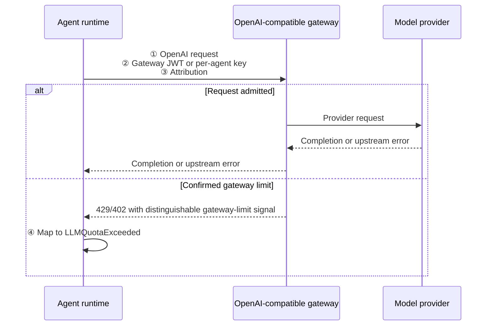
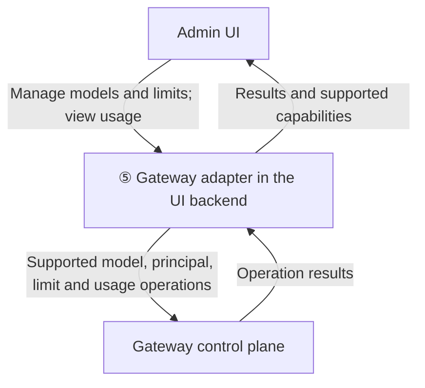
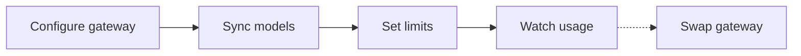
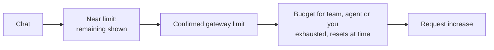
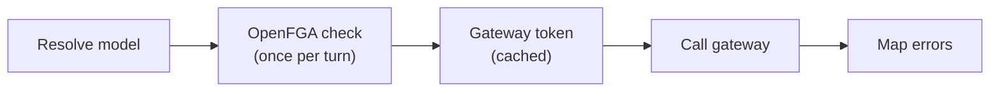

# Feature Specification: Centralise LLM Routing, Quotas and Budgets via a Bring-Your-Own Gateway

**Created**: 2026-10-10

**Status**: Draft (ADR)

**Issue**: #2874 (Epic #2537)

**Input**: "Centralise LLM routing for all CAIPE agents so a gateway can route, enforce quotas and budgets per user, agent and team — plug-and-play with any gateway."

## Overview

- **Problem**: agents call model providers directly. CAIPE cannot route requests, enforce quotas or budgets, or attribute cost to a user, agent or team.
- **Goal**: one gateway-neutral contract. Agents talk to *any* OpenAI-compatible gateway, and the gateway routes, enforces and meters.
- **Non-goal**: CAIPE does not ship or operate a gateway. Operators bring their own: LiteLLM, AgentGateway, Kong AI Gateway, AgentRouter or another.
- **Builds on**: the `openai-compatible` provider in `ai_platform_engineering/llm_wrapper/` (#2820).

### Runtime path

### Administration path

| # | Contract | Owner |
|---|---|---|
| ① | Wire: OpenAI `/v1/chat/completions`, `/v1/models`, `/v1/embeddings` | gateway |
| ② | Identity: short-lived JWT `{sub, agent_id, team_id, org}` | CAIPE issues, gateway verifies |
| ③ | Attribution: OpenAI `user` field, `x-caipe-*` context headers, OTel GenAI | CAIPE sends |
| ④ | Errors: budget/quota rejections → one CAIPE error type | CAIPE maps |
| ⑤ | Control plane: capability-flagged adapter (models, limits, usage) | CAIPE UI backend |

Details: [data plane](./contracts/openai-endpoint.md), [gateway conformance](./contracts/routing-backend-contract.md), [adapter](./contracts/gateway-adapter.md), [research.md](./research.md), [data-model.md](./data-model.md).

## Clarifications

### Session 2026-10-05

- Q: Ship a gateway or BYO? → **BYO only.** CAIPE defines contracts ①–⑤.
- Q: Where do models come from? → **`llm_models` stays the catalogue.** Gateway models are synced into it. Existing `model_id` values keep working.
- Q: Which budget dimensions? → **User, agent and team.**
- Q: Which team pays when a user is in several teams? → **The agent's owning team** (`owner_team_slug`). A per-user limit applies on top.
- Q: How does the gateway trust who is calling? → **A short-lived JWT.**
  - Keycloak signs it via a token exchange with one client scope per agent.
  - Fallback: dynamic agents sign it (see Open Decisions).
  - For gateways that can't validate JWTs: per-agent gateway keys.
- Q: Who governs model access? → **OpenFGA through CAS**, checked by dynamic agents. Gateways with ext_authz can also ask CAS.
- Q: Where do limits and usage live? → **In the gateway only.** Usage is read live; CAIPE keeps no copy.
- Q: Tenancy? → **One tenant per deployment** (one realm, one OpenFGA store, one `organization`).
- Q: Rollout? → **Phased build behind one global switch** (`LLM_GATEWAY_ENABLED`, default off).
- Q: Must the gateway be highly available? → HA is the gateway operator's concern. CAIPE fails closed.
- Q: Latency target? → No hard SLO; measure and document.

### Session 2026-10-09

- Q: Which identity contract does the gateway token follow? → **CAIPE's canonical identity contract** (#2885): platform `iss`/`sub` is the effective principal; the acting service is named separately.
- Q: How do autonomous runs prove the task owner? → **A trusted run binding** (#2891), not an owner ID or unsigned header. The exchange mechanism follows #2890; no new dependency on `requested_subject` impersonation.
- Q: Optional gateway-side authorization? → **The BFF CAS adapter** (#2892, #2909), the same path AgentGateway uses for MCP, instead of the OpenFGA bridge.

## User Journeys *(mandatory)*

### J1 — Platform admin: connect, govern, swap (P1)

1. Sets the gateway endpoint, auth mode and adapter type (`litellm` · `agentgateway` · `kong` · `agentrouter` · `none`). The credential comes through the existing secret strategies.
2. Syncs `/v1/models` into `llm_models`. Model IDs match the existing ones, so agents need no edits.
3. Sets default and per-team, per-agent and per-user limits in the Admin UI. Controls the adapter can't support are hidden.
4. Views usage and spend, read live from the gateway.
5. Approves or rejects quota-increase requests.
6. Swaps gateways by changing the endpoint and adapter. Agents are untouched.
7. With adapter `none`, manages limits in the gateway's own UI. CAIPE still attributes usage and maps errors.

**Acceptance**:
- Given a configured gateway, when the admin turns on `LLM_GATEWAY_ENABLED`, every migrated call path routes through the gateway with no agent edits.
- Given a team limit, when the team's agents exceed it, further calls are rejected and the admin sees the spend.

### J2 — Agent author: pick a model, request a budget (P2)

1. Picks a model from the synced, OpenFGA-filtered `llm_models` list (unchanged UI).
2. The agent's owning team is charged. There is nothing to configure.
3. Optionally requests an agent-specific budget, within the team's limit.

**Acceptance**:
- Given a new agent, when it is saved, CAIPE provisions its gateway identity (the Keycloak client scope, and `ensure_principal` if the adapter needs it). The first call succeeds.

### J3 — End user: chat, see budget, recover (P1)

1. Chats normally in the UI, Slack or Webex. No new step.
2. Sees remaining budget where the adapter supports it.
3. When exhausted, gets an actionable message naming the scope and the reset time, never a generic error.
4. Requests an increase from the message. The request is routed to the admin queue.

**Acceptance**:
- Given an exhausted agent budget, when the user sends a message, the reply names the exhausted scope within one turn and offers "request increase".

### J4 — Agent runtime: call the gateway (P1)

1. Resolves the model from `llm_models`.
2. Checks with OpenFGA that the caller may use this agent and this model, once per turn.
3. Gets a gateway token for (user, agent). Autonomous runs act as the task owner.
4. Calls the gateway with ①②③. Holds no provider keys.
5. Maps budget and quota rejections to ④. Fallback and retries are the gateway's job.

**Acceptance**:
- Given an autonomous run, when it calls the gateway, usage is attributed to the task owner, the agent and the owning team, not to a shared service account.

### Edge cases

- **AI-assist without an executing agent**: `/assistant/suggest` uses a stable, provisioned system agent identity dedicated to AI-assist. The authenticated caller remains `sub`; `agent_id` identifies the AI-assist system agent; `team_id` is its owning team, defaulting to `LLM_GATEWAY_DEFAULT_TEAM`. User, system-agent and team limits apply according to the configured authentication mode (FR-004, FR-005). This identity does not depend on the agent being drafted or edited. Before calling the gateway, the runtime checks access to the system agent and selected model through CAS. AI-assist usage charges the system agent's owning team, regardless of the caller's team memberships.
- **Gateway unreachable**: fail closed with an error naming the gateway. Never fall back to a direct provider.
- **Token service unavailable** (Keycloak or signer): fail closed. Cached tokens are used until they expire.
- **Agent without an owning team** (legacy or system agents): charged to `LLM_GATEWAY_DEFAULT_TEAM` (`platform`). The UI backend provisions that team in CAIPE at startup. Before phase 3, operators prepare its gateway principal where required; phase 3 adapters automate gateway provisioning where supported (see [phase 1 tasks](./tasks.md#phase-1-identity-preparation-and-agent-data-plane)). The per-user limit still applies.
- **Owning team changed**: the token cache key includes `owner_team_slug`, so the next call misses the cache and gets a token for the new team. Under [K2](./research.md#identity-option-legend) the scope is synced before the agent change is saved.
- **User loses access to the agent**: the next turn's OpenFGA check denies, even if a token is cached.
- **Switch off**: every migrated path uses its direct-provider configuration and bypasses the gateway, even when the gateway endpoint is configured and reachable. Valid direct-provider configuration and credentials must be available.
- **Embeddings**: they move only if the gateway serves the *same* embedding model, so vector indexes stay valid.

## Requirements *(mandatory)*

### Wire ①
- **FR-001**: Agents MUST reach the gateway via the OpenAI chat-completions protocol (`openai-compatible` provider), including streaming and tool calls.
- **FR-002**: The gateway endpoint MUST be one deployment-wide setting. Swapping gateways MUST NOT require agent changes.
- **FR-003**: With the switch on, every in-scope path MUST send `llm_models.model_id` to the gateway regardless of the stored or requested provider. This is enforced inside `llm_wrapper.build_chat_model`, not by each caller.

### Identity ②
- **FR-004**: With `LLM_GATEWAY_AUTH=jwt` (default), every gateway call MUST carry a short-lived JWT (TTL ≤ 5 min) with `sub` (effective principal), `act` (acting service), `agent_id`, `team_id` and `org`, verifiable by the gateway. Identity claims follow CAIPE's canonical identity contract (#2885).
- **FR-005**: With `LLM_GATEWAY_AUTH=key` (gateways that can't validate JWTs), calls MUST carry a per-agent gateway key from CAIPE's credentials store. Agent and team are verified; the user is attributed through the `user` field only, so per-user limits are best-effort.
- **FR-006**: Agents MUST NOT hold provider keys or a shared admin key.
- **FR-007**: Autonomous and scheduled runs MUST be attributed to the task owner, proven by a trusted run binding (#2891), not to a shared service account or an unsigned owner header.

### Attribution ③
- **FR-008**: Calls MUST set the OpenAI `user` field to `sub`, and send `x-caipe-conversation-id` and W3C `traceparent`.
- **FR-009**: CAIPE MUST emit OTel GenAI metrics labelled with user, agent, team and caller kind.

### Authorization
- **FR-010**: Dynamic agents MUST check the OpenFGA relations `agent#can_use` and `llm_model#can_read` through the CAS access API (#2889; agent action `use`) once per turn per (user, agent, model), before the first LLM call. A gateway with ext_authz MAY also ask the BFF CAS adapter (#2909).

### Errors ④
- **FR-011**: Upstream provider errors MUST pass through with their class preserved.
- **FR-012**: Confirmed gateway budget and quota rejections MUST become `LLMQuotaExceeded`, naming the scope (user, agent or team) and reset time where known. Recognition MUST use a declarative rule identifying a gateway-enforced limit through a distinguishable signal; status codes or keywords alone are insufficient. Unmatched or ambiguous errors MUST retain their original classification without inferred scope or budget-increase advice.
- **FR-013**: An unreachable or misconfigured gateway MUST fail closed with a clear error. No silent fallback.

### Control plane ⑤
- **FR-014**: The UI backend MUST talk to the gateway through an adapter exposing `capabilities`, `list_models`, `ensure_principal`, `set_limit` and `get_usage`. The UI MUST hide what the adapter doesn't support.
- **FR-015**: Limits and usage MUST live only in the gateway. CAIPE MUST NOT keep a copy.
- **FR-016**: Quota-increase requests MUST be stored in CAIPE (Mongo `llm_quota_requests`) and approved through the admin UI.

### Rollout
- **FR-017**: Adopting the gateway MUST NOT require agent source changes.
- **FR-018**: Gateway routing MUST be off by default. With `LLM_GATEWAY_ENABLED=false`, every migrated path MUST use its direct-provider configuration and bypass the gateway even when its endpoint is configured and reachable. With the switch on, gateway failures MUST fail closed without automatic direct-provider fallback.
- **FR-019**: Delivery MUST be phased. The global switch disables gateway routing across all migrated paths. Rolling back an individual phase requires reverting the relevant deployment or code changes while respecting phase dependencies (see [plan.md](./plan.md)).

## Key Entities

- **Gateway**: an operator-run, OpenAI-compatible LLM gateway.
- **Gateway token**: a short-lived JWT identifying user, agent, owning team and organization.
- **Agent scope**: one Keycloak client scope per agent carrying `agent_id` and `team_id`.
- **LLM model** (`llm_models`): the catalogue entry an agent selects; gateway models are synced in.
- **Limit**: a budget or quota for one principal (user, agent or team), stored in the gateway.
- **Quota request**: a user or author request for more budget, stored in CAIPE.
- **Adapter**: the per-gateway control-plane implementation with declared capabilities.

## Success Criteria

- **SC-001**: Swapping gateways requires zero agent changes.
- **SC-002**: With JWT auth, every LLM call path in scope is attributed to user, agent and team (100% of sampled calls).
- **SC-003**: Exceeding any limit produces the actionable error (④) in 100% of cases. No generic errors.
- **SC-004**: With a gateway configured and reachable and `LLM_GATEWAY_ENABLED=false`, automated tests MUST verify successful direct-provider calls and zero inference requests to the gateway for every migrated path.
- **SC-005**: A forged or expired identity is rejected by the gateway (zero accepted forgeries in conformance tests).
- **SC-006**: The added latency (cached token) is measured and documented.
- **SC-007**: At least two different gateways pass [the conformance contract](./contracts/routing-backend-contract.md).

## Assumptions

- "OpenAI" names the wire protocol, not the provider.
- Keycloak 26.3 token exchange can emit per-agent scope claims (to be confirmed by spike S1, see [research.md](./research.md)).
- The gateway can reach the token issuer's JWKS.
- Dynamic agents authenticate callers from the bearer token alone (#1753) before the gateway token is minted.
- The delegation mechanism for autonomous runs is decided by #2890; spike S1 tests the gateway scope against that mechanism.
- The OpenAI wire format loses some provider-native features, such as prompt caching and thinking parameters. Native providers in `llm_wrapper` remain available while the switch is off.
- Related work is listed in [research.md](./research.md#related-work).

## Open Decisions

- **OD-1 Signer**: Keycloak per-agent scope ([K2](./research.md#identity-option-legend)) is the target. If spike S1 fails, dynamic agents sign ([C1](./research.md#identity-option-legend)). Claims and budget keys are identical either way; during a switch the gateway trusts both issuers.

## Out of Scope

- Shipping, operating or scaling a gateway.
- An in-process routing library (consistent with `2026-09-24-remove-cnoe-agent-utils` FR-024).
- Gateway-side fallback and retry policy (the gateway's job).
- Multi-tenant deployments sharing one CAIPE instance.
- Implementation. It is tracked under Epic #2537; see [tasks.md](./tasks.md).
